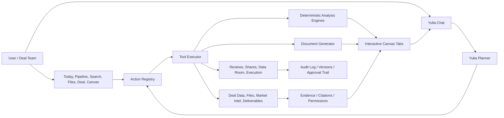

# Yulia Agentic Platform Build Plan

Saved: May 11, 2026  
Execution refresh: May 13, 2026

## Restore Point Protocol

The current active clone is `/Users/paul/Desktop/SMBx-active`.

Starting restore point:

- Commit: `9132cb9`
- Tag: `restore/agentic-build-start-20260513-174322`
- Purpose: preserve the current UI, texture, mobile/desktop, and early agency work before the next sequential build pass.

Going forward, work should be saved in small restore-point commits at the end of every meaningful phase:

1. **Phase checkpoint commit:** after a phase builds and passes local verification.
2. **Tag:** `restore/agentic-phase-N-YYYYMMDD-HHMMSS`.
3. **Optional push:** only when the phase is stable enough for Railway/prod testing.
4. **Rollback rule:** if a phase drifts visually or functionally, return to the most recent restore tag instead of trying to untangle a large dirty working tree.

Suggested cadence:

- Commit before any high-risk schema/API refactor.
- Commit after every action-surface batch.
- Commit after every working end-to-end flow.
- Commit before pushing to `main`.

## Sequential Execution Plan

This is the order to knock the remaining work out. Each phase should finish with a build, targeted test, restore-point commit, and short note in this document.

### Phase A — Surface Action Audit and Contract Map

Goal: every visible command has a real backend action or a deliberate disabled/future state.

Tasks:

- Inventory every desktop button/card/chevron/menu action across Today, Pipeline, Search, Files, Deal Detail, Analysis, Document Viewer, and Learn.
- Inventory every mobile action across Today, Pipeline, Search, Files, Deal Detail, Analysis, Document Viewer, and chat sheet.
- Map each action to an existing action contract or add the missing contract.
- Remove or relabel controls that imply a backend action that does not exist yet.
- Add a local action manifest so desktop, mobile, and chat can share action names.

Done when:

- No primary button silently navigates to the wrong surface.
- Every user-facing action has one canonical action name.
- The manifest identifies gaps clearly instead of hiding them.

Checkpoint A.1, May 13:

- Added a frontend surface action manifest so UI controls can point to canonical action IDs instead of relying on display text.
- Updated deal brief next moves to carry hidden `actionId` metadata from Yulia's briefing layer.
- Fixed Yulia's tool schema so `tax_legal_structure` can be selected by Claude and opened as a structured canvas.
- Updated deal detail recommended moves to prefer explicit action metadata before falling back to text matching.
- Updated `compare_deals` tool description to reflect that it now opens a canvas, not only a chat table.

Checkpoint A.2, May 13:

- Extended structured analysis `nextActions` with hidden `surfaceActionId`, target deal, analysis type, and file-scope metadata.
- Updated deterministic analysis outputs so comparison, tax/legal, evidence, and file actions carry executable intent instead of relying only on button text.
- Wired desktop analysis next-action rows to the same live analysis/file/model/review contracts used by deal detail.
- Added mobile analysis next-action rows so phone canvases can open deal files, rerun follow-on analyses, and jump to scenario sliders with the same intent metadata.
- Verified the app builds after the action metadata and analysis canvas changes.

### Phase B — Unified Action Dispatcher

Goal: UI clicks and Yulia chat commands execute through the same governed action spine.

Tasks:

- Add a typed frontend action dispatcher.
- Route buttons through the dispatcher instead of ad hoc `openTab`, `ask`, or placeholder navigation when the action is material.
- Make dispatcher responses handle: open tab, open mobile view, update canvas, stage confirmation, show error, or ask for missing input.
- Ensure chat tool results use the same surface action payload shape.

Done when:

- Clicking “Run analysis” and asking Yulia to run the same analysis produce the same backend action and canvas result.

Checkpoint B.1, May 13:

- Added a shared frontend `executeSurfaceAction` path for analysis actions, starting with Analysis Home tools and deal-comparison.
- Added a persisted `/api/deals/compare` analysis endpoint so UI-triggered comparisons create the same structured analysis-run object shape as Yulia's `compare_deals` tool.
- Added explicit `run_recast_analysis` and `run_sba_analysis` surface actions so Recast P&L and SBA tools do not masquerade as adjacent models.
- Updated Today so logged-in recommendation surfaces do not fall back to static card-authored suggestions if the Yulia portfolio brief is unavailable; they show a Yulia-read refresh state instead.
- Captured the rule that cards do not author recommendations. Yulia's portfolio/deal intelligence layer is the source of next moves, warnings, rankings, and suggested actions.

Checkpoint B.2, May 13:

- Extended Yulia's portfolio briefing payload so priority items carry explicit `actionId` metadata from the intelligence layer.
- Updated deterministic portfolio fallback to assign action contracts from live user data instead of letting the frontend infer intent from card text.
- Expanded the shared frontend dispatcher beyond analysis so Yulia-originated priorities can open deals, files, documents, modes, generated deliverables, comparisons, or governed confirmation prompts through one path.
- Re-routed Today priority cards through the dispatcher; the card is now a presentation surface for Yulia's read, not the author of the recommendation or action.

### Phase C — Analysis Workbench Completion

Goal: analysis is always a canvas artifact, not chat math.

Tasks:

- Finish reusable structured analysis canvas.
- Add sliders for every adjustable numeric input.
- Add scenario labels: Base, Downside, Upside, Custom.
- Add saved scenario history and restore.
- Add version comparison.
- Add Yulia context bridge: chat knows active analysis, active scenario, current version, and changed assumptions.
- Add export/share/request-review actions.

Done when:

- A valuation, SBA, working-capital, capital-structure, market-intelligence, and comparison analysis can be run, adjusted, saved, reopened, and discussed with Yulia.

### Phase D — Full Analysis and Model Catalog

Goal: cover SMB through institutional/big-deal work with deterministic math plus LLM explanation.

Tasks:

- Expand model definitions using `METHODOLOGY_V17.md`, `METHODOLOGY_V18a_TAX_AMENDMENT.md`, and `METHODOLOGY_V18b_LEGAL_AMENDMENT.md`.
- Fill model families: normalization/QoE, valuation, financing, LBO, DCF, comps, buyer fit, tax, legal, LOI terms, red flags, PMI, portfolio comparison.
- Add required-input checks and missing-data prompts.
- Add professional-trigger outputs for tax/legal/counsel/lender/banker review.

Done when:

- Yulia can select the right model by deal archetype, league, gate, and user request without dumping unsupported numbers into chat.

### Phase E — Evidence and Market Intelligence Runtime

Goal: Yulia becomes the go-to market intelligence source, not a static dashboard.

Tasks:

- Add evidence/citation objects to analysis runs.
- Connect market reads to cached/source-backed industry, buyer, lender, legal, tax, and macro signals.
- Add freshness timestamps and source quality.
- Generate scheduled portfolio and deal reads.
- Replace static Today/Deal commentary with cached Yulia reads from live facts.

Done when:

- Today and Deal Detail market intelligence are generated from real deal/file/market data with sources and freshness.

### Phase F — Document Lifecycle and Data Room

Goal: every document/file state change is real and governed.

Tasks:

- Normalize private workspace, all files, data room, shared, review, deferred, action-needed, executed.
- Wire document creation, opening, editing, review request, share, file-to-data-room, and executed-lock actions.
- Enforce immutability for executed records.
- Add audit events and permission checks.

Done when:

- A private draft can move through review, sharing/data-room placement, execution, and immutable storage without fake UI states.

### Phase G — Governance, Guardrails, and Model Routing

Goal: Yulia acts autonomously inside the right legal/tax/broker boundaries.

Tasks:

- Load methodology, legal, tax, and market posture into runtime context.
- Enforce action permission levels.
- Stage external/irreversible actions for confirmation.
- Route tax/legal answers through issue-spotting and handoff language.
- Feed user model preference into chat, analysis generation, market intelligence, and document generation.

Done when:

- Yulia can do the work, but signoff/communication/execution remains with the user or licensed professional where required.

### Phase H — Test Harness and Production Readiness

Goal: no fake buttons, no cross-user data leaks, no silent regressions.

Tasks:

- Add Playwright coverage for the main desktop and mobile flows.
- Add API tests for action contracts, analysis runs, scenario saves, document lifecycle, data-room actions, and staged confirmations.
- Add golden test deals and expected formula outputs.
- Add production smoke checklist for Railway.

Done when:

- We can push with confidence and test live without guessing what is wired.

## North Star

Yulia should be the operating layer for M&A work, not a chatbot bolted onto deal software. The user should not need to learn how to operate the app. They should understand the deal, make decisions, approve external actions, and bring in licensed professionals where required. Yulia does the software operation, analysis assembly, document generation, evidence tracking, work routing, and follow-through.

The platform must support any size deal, from owner-operated Main Street transactions through sponsor-backed platforms, corporate development, carve-outs, cross-border transactions, public company deals, and post-close value capture.

Yulia is an agentic deal-team member. She generates analysis, options, implications, drafts, models, and work plans. Users decide. Licensed attorneys, CPAs, tax counsel, lenders, bankers, and other professionals sign off where the work crosses into regulated professional judgment.

## Product Standard

The app is finished only when every surface is backed by real data, every meaningful button maps to a real action, and every Yulia response can open or update the correct canvas, document, model, file, deal, search result, or review queue.

No more fake demo-only buttons. Demo data may exist for logged-out or sample mode, but logged-in users must see their own deals, files, analyses, and Yulia-generated work.

### Yulia-Originated Recommendations

Cards, rows, pills, and panels are presentation surfaces only. They do not author recommendations.

Any suggestive or judgment-bearing statement must originate from Yulia's portfolio/deal intelligence layer:

- next moves
- "needs action" items
- rankings and priority queues
- "what changed" notes
- market, tax, legal, financing, diligence, or file warnings
- "Yulia is working/watching/recommends" language
- recommended documents, analyses, scenarios, reviews, and outreach

For logged-in users, those statements must come from live user/deal/file/analysis context through cached or fresh Yulia reads. Deterministic fallback is acceptable only as Yulia's briefing-layer fallback when the LLM or source refresh is unavailable, and it must be derived from actual user data.

Static copy may describe the product, empty states, or logged-out samples, but it must not masquerade as Yulia's analysis of the user's portfolio. If the system does not have enough data to make a recommendation, the UI should say what Yulia needs next rather than inventing a card-level suggestion.

## Current Foundation

The codebase already has several important pieces:

- Deal, deliverable, canvas tab, market intelligence, collaboration, review, and agency event tables.
- Yulia tool calls that can generate deliverables and open canvas tabs.
- A `run_analysis` action contract that can route analysis requests into the canvas instead of dumping numbers into chat.
- A `compare_deals` path that can open a comparison tab.
- A model store with early interactive model types: valuation, LBO, SBA financing, DCF, sensitivity, comparison, cap table, earnout, tax impact, working capital, covenant, and SDE analysis.
- Methodology docs defining math, workflow, canvas, tax, and legal guardrails:
  - `METHODOLOGY_V17.md`
  - `METHODOLOGY_V18a_TAX_AMENDMENT.md`
  - `METHODOLOGY_V18b_LEGAL_AMENDMENT.md`

The gap is that these pieces are not yet one coherent execution system. Yulia can sometimes generate a deliverable, but she cannot yet reliably create an interactive analysis, cite its evidence, update assumptions, compare scenarios, maintain versions, attach findings to a deal, route signoffs, and keep the UI in sync across Today, Pipeline, Files, Deal Detail, Search, and Chat.

## Non-Negotiable Architecture

### 0. Chat-First Intent, Contract-Based Execution

Yulia remains a chat-first agent. Users should not need to learn commands, keywords, routes, or software operations.

The action system is not a hard-coded command language for chat. It is the governed execution layer underneath Yulia's natural-language understanding:

1. The user speaks naturally.
2. Yulia interprets the user's intent with full deal, methodology, file, model, and portfolio context.
3. If the intent requires action, Yulia chooses the right governed action/tool.
4. The action opens or updates the correct surface: analysis canvas, document, model, file view, deal page, search run, review queue, or staged confirmation.

Buttons, cards, and chevrons are shortcuts into the same contracts. They are not the primary interface. The primary interface is still Yulia understanding what the user is trying to accomplish and doing the software work on their behalf.

Hard-coded keyword matching should only be used as a temporary UI fallback for static demo rows, not as the chat architecture. Where possible, UI rows should carry explicit action metadata from the backend instead of guessing from display text.

### 1. Action Contracts

Every UI command and every Yulia command must map to the same action registry.

Examples:

- Generate LOI
- Run buyer fit analysis
- Run valuation
- Build LBO model
- Compare deals
- Open deliverable
- Open analysis canvas
- File item to data room
- Stage share
- Request review
- Mark executed and immutable
- Ask Yulia for market read
- Search buyers
- Build target list
- Run tax structure comparison
- Run legal issue matrix
- Create 100-day plan

The UI and chat must not have separate logic. If a button can do it, Yulia can do it. If Yulia can do it, a surface can expose it.

### 2. Evidence-First Analysis

No serious analysis should be just markdown. An analysis is a structured object:

- Inputs
- Assumptions
- Formula outputs
- Evidence and citations
- Charts/tables
- Yulia commentary
- Risk flags
- Missing data
- Professional handoff triggers
- Version history
- User-approved actions

Markdown can summarize the analysis, but the source of truth must be structured.

### 3. Deterministic Math, LLM Explanation

LLMs should not invent numbers. Math models compute outputs deterministically. Yulia explains, challenges assumptions, compares cases, asks for missing facts, and prepares decision-ready summaries from those outputs.

### 4. Permission-Aware Workspaces

The deal library has three major spaces:

- Private workspace: user's work product, drafts, analyses, notes, models.
- Data room: shared diligence drive for artifacts, drafted legal docs, reviewed items, and executed records.
- Shared: sent, received, deferred, awaiting action, awaiting review, awaiting execution.

Yulia must respect role, participant, deal, and document permissions at retrieval, analysis, sharing, and export time.

### 5. Immutable Execution Layer

Executed documents are not editable work product. They become immutable records with:

- Hash/checksum
- Final version pointer
- Execution metadata
- Parties
- Source history
- Audit trail
- Permission policy

## Target System

## Required Data Model

Add or formalize these concepts:

### `analysis_definitions`

Registry of every model Yulia can run.

Fields:

- `slug`
- `name`
- `category`
- `deal_archetypes`
- `league_min`
- `league_max`
- `required_inputs`
- `optional_inputs`
- `evidence_requirements`
- `calculation_engine`
- `output_schema`
- `chart_schema`
- `guardrail_schema`
- `professional_handoff_triggers`
- `model_version`
- `status`

### `analysis_runs`

Actual user/deal-specific analysis instance.

Fields:

- `id`
- `user_id`
- `deal_id`
- `definition_slug`
- `status`
- `input_snapshot`
- `assumption_snapshot`
- `output_json`
- `commentary_markdown`
- `missing_data`
- `risk_flags`
- `professional_handoff_flags`
- `canvas_tab_id`
- `created_by`
- `approved_by`
- `created_at`
- `updated_at`

### `analysis_evidence`

Source material supporting the run.

Fields:

- `analysis_run_id`
- `source_type`
- `source_id`
- `file_id`
- `deliverable_id`
- `market_report_id`
- `page`
- `section`
- `quote_or_excerpt`
- `confidence`
- `permission_scope`

### `analysis_versions`

Version history for assumption changes and reruns.

Fields:

- `analysis_run_id`
- `version`
- `changed_by`
- `change_reason`
- `input_snapshot`
- `output_snapshot`
- `created_at`

### `model_tabs`

Canvas-native, interactive model state.

Fields:

- `conversation_id`
- `deal_id`
- `analysis_run_id`
- `model_type`
- `assumptions`
- `outputs`
- `linked_tabs`
- `active_scenario`
- `created_at`
- `updated_at`

## Complete Model Library

### A. Financial Normalization

- SDE normalization
- Adjusted EBITDA bridge
- Quality of earnings
- Add-back review
- Owner compensation normalization
- Revenue quality
- Gross margin bridge
- EBITDA margin bridge
- Customer concentration
- Vendor concentration
- Working capital normalization
- CapEx split: maintenance vs growth
- Free cash flow waterfall
- Balance sheet quality
- Debt-like items review
- Net debt bridge
- Cash-free/debt-free bridge

### B. Valuation

- SDE multiple valuation
- Adjusted EBITDA multiple valuation
- Public company comparable analysis
- Precedent transaction analysis
- DCF
- LBO valuation
- Strategic buyer / synergy valuation
- Sum-of-the-parts
- Asset / liquidation floor
- Replacement-cost floor
- Valuation bridge
- Football field chart
- Sensitivity tables
- Price gap analysis
- Fairness-style valuation support, with no fairness opinion language

### C. Financing and Capital Structure

- Sources and uses
- Debt capacity
- SBA feasibility and DSCR
- Senior debt case
- Unitranche case
- Mezzanine case
- Seller note case
- Earnout structure
- Rollover equity
- Preferred equity
- Covenant headroom
- Cash sweep
- Amortization schedule
- Interest-rate sensitivity
- Downside case financing
- Refinancing case
- Lender memo support

### D. Institutional / Big-Deal Models

- Full LBO model
- IRR and MOIC
- Sponsor base/upside/downside cases
- Debt schedule
- Exit multiple sensitivity
- Operating case model
- Management case bridge
- Synergy case
- Accretion/dilution
- Merger model
- Purchase accounting
- Pro forma financial statements
- Carve-out separation cost
- TSA cost model
- Standalone cost model
- Integration value capture
- 100-day plan economics
- Hold-period value creation bridge
- Regulatory screen: HSR, CFIUS, industry-specific
- Public company process issue screen

### E. Tax Models

From `METHODOLOGY_V18a_TAX_AMENDMENT.md`:

- Asset vs stock vs merger comparison
- F-reorganization structure
- Section 338(h)(10)
- Section 336(e)
- Section 1060 allocation
- Section 197 amortization
- Installment sale / Section 453
- Earnout tax treatment
- Rollover equity and Section 83(b)
- Section 1202 QSBS
- Section 382 NOL limitation
- Section 163(j)
- Bonus depreciation / Section 168(k)
- Partnership hot assets / Section 751
- Section 754 / 743 / 734 basis adjustments
- Transaction cost capitalization
- Section 280G
- SALT conformity and state allocation
- International screen: withholding, treaty, BEAT, GILTI/FDII, Pillar Two
- Tax structure comparison matrix
- CPA handoff memo

Tax output must always be framed as analysis and questions for CPA/tax counsel, not final tax advice.

### F. Legal / Deal-Term Models

From `METHODOLOGY_V18b_LEGAL_AMENDMENT.md`:

- LOI issue matrix
- LOI comparison
- APA/SPA issue matrix
- Reps and warranties matrix
- Disclosure schedule tracker
- Indemnity economics
- Basket/cap/escrow comparison
- RWI economics
- Sandbagging risk
- MAE/MAC issue screen
- Fraud carve-out review
- Working capital true-up dispute model
- Closing conditions tracker
- Regulatory approval matrix
- HSR / CFIUS screen
- Employment/labor issue matrix
- IP/privacy/security issue matrix
- Environmental issue matrix
- Governance approval tracker
- Counsel handoff memo

Legal output must stop at issue spotting, options, implications, and negotiation considerations.

### G. Market Intelligence

This must be front and center in the app.

- Market heat index
- Industry health index
- Buyer universe
- Buyer appetite
- Capital availability
- Lender appetite
- Sector transaction comps
- Active acquirer map
- PE/platform map
- Sponsor behavior by thesis
- Source gap analysis
- Event-to-deal relevance
- Macro overlay
- Regulatory/tax/legal watch
- Portfolio-wide market read
- Deal-specific market read
- Daily/weekly scheduled Yulia read

The user should not have to Google industry insights. Yulia should pull, cache, cite, synthesize, and connect market intelligence to each deal.

### H. Comparison Models

- Deal-to-deal comparison
- Portfolio ranking
- Buyer comparison
- LOI comparison
- Capital stack comparison
- Tax structure comparison
- Legal structure comparison
- Diligence readiness comparison
- Data-room completeness comparison
- Post-close value plan comparison
- Risk-adjusted return comparison

Comparisons must open interactive canvas views, not just chat tables.

## Yulia Tool Layer

Yulia needs tools for:

- `run_analysis`
- `create_interactive_model`
- `update_model_assumption`
- `read_model_state`
- `compare_deals`
- `compare_structures`
- `compare_lois`
- `create_chart`
- `attach_evidence`
- `generate_deliverable`
- `refresh_market_read`
- `search_market`
- `create_target_list`
- `create_buyer_list`
- `open_file`
- `file_to_data_room`
- `stage_share`
- `request_review`
- `defer_to_professional`
- `mark_executed`
- `lock_record`
- `create_task`
- `update_deal_stage`
- `open_canvas_tab`

Each tool must return a canvas action when the result belongs in the app surface.

## Surface Contracts

### Chat

Chat is the orchestration layer. It should not be where full analyses live. Chat should:

- Understand the current page and selected deal.
- Trigger real actions.
- Open/update canvas tabs.
- Summarize next decisions.
- Ask for missing data.
- Route review and approvals.

### Today

Today is Yulia's daily operating brief:

- Portfolio-wide market intelligence.
- Deal of the day.
- Priority queue.
- Files needing action.
- Drafts/reviews/executed work.
- Recommended next moves.
- Live Yulia background tasks.

### Pipeline

Pipeline is deal triage and ranking:

- Deal score.
- Market read.
- current gate.
- next action.
- comparison.
- open deal.
- run analysis.

### Search

Search is market discovery:

- Buyers.
- Buyer pools.
- Targets.
- PE firms.
- Lenders.
- attorneys and other deal professionals.
- Thesis-driven lists.
- Results can become deal records, buyer lists, or outreach work product.

### Files

Files is the deal operating file system:

- All files by portfolio > deal > stage.
- Deal libraries.
- Data rooms.
- Shared items.
- Action queues.
- Recents and hot docs.
- Open any file, analysis, model, artifact, or executed record.

### Deal Detail

Deal Detail is the live deal cockpit:

- Yulia verdict.
- Market intelligence.
- fit score and reason.
- key economics.
- risk register.
- recommended actions.
- files/data room.
- analysis/model tabs.
- next-stage readiness.

### Analysis Canvas

Analysis Canvas is where real work happens:

- Charts.
- Tables.
- Assumptions as sliders for every adjustable numeric input.
- Sensitivities.
- Scenario toggles.
- Saved scenario versions.
- evidence.
- Yulia commentary.
- Ask Yulia about this analysis.
- Export / share / send for review.

### Document Viewer

Document Viewer must support:

- View.
- Edit where editable.
- Comment.
- Ask Yulia about selection.
- Generate redline.
- Compare versions.
- Request review.
- Share.
- Execute and lock where appropriate.

## Build Phases

### Phase 0 — Safety and Checkpoint

- Commit current UI/texture/agency work.
- Confirm Railway env status.
- Confirm production deploy branch.
- Confirm seed/demo mode vs logged-in user data mode.

### Phase 1 — Analysis Registry and Persistence

- Add `analysis_definitions`.
- Add `analysis_runs`.
- Add `analysis_evidence`.
- Add `analysis_versions`.
- Seed initial definitions from methodology docs.
- Connect `run_analysis` to `analysis_runs`.
- Persist analysis tab state.

Done when: asking Yulia for buyer fit, valuation, market intelligence, or comparison creates a saved analysis run and opens a canvas tab.

### Phase 2 — First Real Model Family

Implement deterministic engines for:

- SDE/EBITDA bridge.
- Valuation range.
- Working capital peg.
- Capital structure.
- SBA financing.
- LBO light.
- Buyer fit.
- Deal comparison.

Done when: outputs are structured JSON, chart-ready, assumption-driven, and discussable with Yulia.

### Phase 3 — Interactive Canvas

- Build reusable canvas shell.
- Build chart components.
- Build assumption panels.
- Build version history.
- Build source/evidence panel.
- Build “Ask Yulia about this” context bridge.
- Build export/share/review actions.

Done when: the user can change assumptions and Yulia can respond using the updated model state.

### Phase 4 — Market Intelligence Runtime

- Connect market intelligence sources and cache.
- Build deal-specific market read.
- Build portfolio-wide market read.
- Build scheduled refresh.
- Link market events to deals.
- Add citations and recency stamps.
- Show front-and-center on Today and Deal Detail.

Done when: Today and Deal Detail comments are LLM-synthesized from current market intelligence and deal facts, not static copy.

### Phase 5 — Document Lifecycle

- Private draft.
- Analysis/doc.
- Data room artifact/shared doc.
- Review.
- Redline/compare.
- Execution.
- Immutable record.

Done when: every file action changes real state and appears in Files, Deal Detail, Today, and Chat.

### Phase 6 — Tax and Legal Guardrails

- Encode tax/legal trigger matrices.
- Add professional handoff flags.
- Add CPA/counsel handoff memos.
- Add prohibited-output checks.
- Add user-facing deferral language only when needed.

Done when: Yulia can run sophisticated tax/legal structure analysis while staying on the analysis side of the line.

### Phase 7 — Institutional / Big-Deal Expansion

- Full LBO.
- Accretion/dilution.
- Pro forma model.
- Purchase accounting.
- Carve-out/TSA.
- Synergy capture.
- HSR/CFIUS/regulatory screen.
- Public company process screens.
- Board/IC memo support.

Done when: a PE, corp dev, or banking user can run a serious institutional deal workflow without the product feeling SMB-only.

### Phase 8 — Workflow Orchestration

- Background Yulia jobs.
- Work queues.
- Task creation.
- Approvals.
- Review routing.
- External participants.
- Role-aware notifications.
- Audit trail.

Done when: Yulia can move work from insight to next action without the user manually operating every surface.

### Phase 9 — QA and Trust

- Golden test deals.
- Formula test vectors.
- Permission tests.
- Evidence/citation tests.
- Tool-call contract tests.
- Regression tests for every UI button.
- Production smoke tests.

Done when: no major visible button is fake, no analysis is chat-only, no professional-boundary output crosses the line, and no user sees another user's data.

## Immediate Build List

1. Add analysis persistence schema. **Done in migration `063_analysis_runtime.sql`.**
2. Seed the analysis definition registry. **Done for the first core definitions: scorecard, buyer fit, valuation, recast, working capital, capital structure, SBA, market intelligence, tax/legal structure, and deal comparison.**
3. Refactor `run_analysis` to create an `analysis_run`. **Done for queued analysis deliverables.**
4. Make comparison tabs persist as analysis runs. **Done for `compare_deals`.**
5. Persist model-tab creation against analysis runs. **Started for `create_model_tab`.**
6. Build a real interactive valuation/SDE canvas. **Started: `run_analysis` now returns structured deterministic outputs for valuation, recast, working capital, capital structure, SBA, market intelligence, tax/legal, red flags, buyer fit, and PMI; the canvas renders those outputs.**
7. Build a real deal comparison canvas. **Advanced: comparisons now persist structured rankings, metrics, tables, risks, missing data, and Yulia read metadata.**
8. Add Yulia tools for `read_model_state` and `update_model_assumption`. **Started: `read_tab_state` and `update_model` now read/write persisted model and analysis-run state.**
9. Make all adjustable analysis assumptions scenario sliders, not freeform text fields. **Started: structured analysis canvases now expose slider-based scenario saves and an Ask Yulia prompt tied to the active scenario.**
10. Wire “Run analysis” buttons across Today, Pipeline, Deal Detail, Search, Files, and Analysis Root.
11. Add market intelligence refresh/read pipeline with evidence and recency.
12. Replace static Yulia comments with cached, LLM-synthesized portfolio/deal reads.
13. Build data-room/share/executed lifecycle actions.
14. Add permissions and audit enforcement on every read/write action.
15. Add tests that click through every button and verify real action results.

## Implementation Checkpoint — May 12, 2026

Phase 1 has moved from concept into code. The platform now has the persistence layer needed for durable analysis:

- `analysis_definitions`: the registry of what Yulia can run.
- `analysis_runs`: each user/deal analysis request, with status, inputs, outputs, run metadata, and canvas tab id.
- `analysis_evidence`: source/citation records for the evidence-first layer.
- `analysis_versions`: assumption/output version history.
- `model_tabs`: deterministic model state tied back to a run and conversation.

The first tool wiring is also in place:

- `run_analysis` now resolves the menu item, queues the deliverable, creates an `analysis_run`, and opens an analysis canvas tab instead of only behaving like a document generator.
- `compare_deals` now creates a complete `deal_comparison` analysis run and opens the comparison canvas.
- `create_model_tab` now creates an analysis run and records model-tab state.

The first slice of Phase 2 is now in code:

- `deterministicAnalysisEngine.ts` builds structured, deterministic analysis payloads for buyer fit, scorecards, valuation, recast, working capital, capital structure, SBA, market intelligence, tax/legal structure, red flags, PMI, and deal comparison.
- `run_analysis` attaches those payloads to `analysis_runs.outputs.structuredAnalysis`, stores Yulia commentary, risks, missing data, professional triggers, assumptions, and market context, then opens the analysis tab with the same payload.
- `compare_deals` now creates a structured comparison analysis instead of only returning a markdown table.
- `V6AnalysisView` now renders structured analysis tabs with verdict, metrics, chart-ready bars/ranges, tables, risk register, missing data, professional-review triggers, next actions, methodology references, inputs, and assumptions.

The next target is interactivity: editable assumptions, persisted model versions, evidence links, and Yulia reading the current model state before answering.

## Implementation Checkpoint — May 12, 2026, Phase 3 Start

The first interactive loop is now wired:

- `analysisRuntime.ts` can read an analysis snapshot, update assumptions/outputs, increment `analysis_versions`, read model-tab state, and update model-tab state.
- `update_model` now persists model/analysis state when the active tab is linked to a run, and returns the saved version number to the canvas.
- `read_tab_state` now returns the saved canvas/model state instead of a placeholder.
- `V6App` now handles `create_model_tab`, `update_model`, and `read_tab_state` canvas actions, keeping open tabs synchronized with Yulia tool results.
- `yuliaSurfaceContext` now sends analysis run id, canvas version, and a compact model-state summary so Yulia can resolve “this analysis” and discuss the active canvas.
- `V6AnalysisView` structured canvases now expose editable assumptions. Saving an assumption updates the canvas immediately and, when authenticated, writes a new versioned analysis snapshot through `/api/analysis-runs/:analysisRunId/assumptions`.
- Adjustable numeric assumptions now render as scenario sliders instead of text fields. A saved scenario writes a new analysis version, updates the active model state, and leaves the canvas in a state Yulia can discuss from chat.

Still needed for Phase 3:

- Recalculate deterministic outputs from changed assumptions instead of only versioning the assumption layer. **Started: structured analysis saves now rebuild the deterministic analysis from the deal row plus edited assumptions, then stores the recalculated canvas output in the next version.**
- Add version history UI and restore/version compare.
- Add saved scenario labels/history in the canvas UI so users can compare base, downside, upside, and custom cases.
- Add evidence/citation side panel linked to `analysis_evidence`.
- Add export/share/review actions from structured canvases.
- Add Playwright coverage that opens a real analysis, changes an assumption, verifies the version bump, and asks Yulia about the updated state.

## Definition of Done

The app is truly agentic when:

- A user can ask “compare these three deals” and a comparison canvas opens.
- A user can ask “run valuation” and a live model opens with editable assumptions.
- A user can ask “what changed in my portfolio today” and Yulia uses real market/deal/file data.
- A user can ask “draft the LOI, send it for review, and put the final executed copy in the data room” and Yulia orchestrates the full lifecycle with approvals.
- A user can ask tax/legal/structure questions and Yulia runs the math, identifies issues, and routes signoff to CPA/counsel where required.
- A user can open any UI surface and every button does something real.
- Every analysis has inputs, outputs, evidence, commentary, and version history.
- Every generated artifact lives in the right place in Files.
- The platform can handle small, mid-market, sponsor-backed, corporate, public, cross-border, and post-close workflows without changing products.
