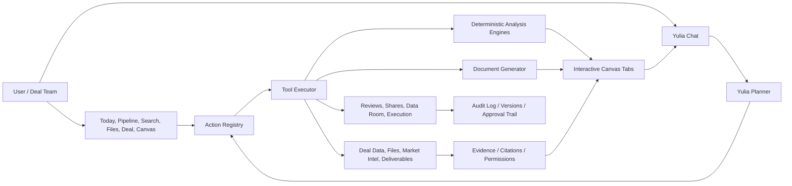

# Yulia Agentic Platform Build Plan

Saved: May 11, 2026  
Execution refresh: May 13, 2026
V19 refresh: May 15, 2026

## Restore Point Protocol

The current active clone is `/Users/paul/Desktop/SMBx-active`.

Starting restore point:

- Commit: `9132cb9`
- Tag: `restore/agentic-build-start-20260513-174322`
- Purpose: preserve the current UI, texture, mobile/desktop, and early agency work before the next sequential build pass.

Going forward, work should be saved in small restore-point commits at the end of every meaningful phase:

1. **Phase checkpoint commit:** after a phase builds and passes local verification.
2. **Tag:** `restore/agentic-phase-N-YYYYMMDD-HHMMSS`.
3. **Optional push:** only when the phase is stable enough for Railway/prod testing.
4. **Rollback rule:** if a phase drifts visually or functionally, return to the most recent restore tag instead of trying to untangle a large dirty working tree.

Suggested cadence:

- Commit before any high-risk schema/API refactor.
- Commit after every action-surface batch.
- Commit after every working end-to-end flow.
- Commit before pushing to `main`.

## V19 Operating Addendum — Agentic Platform Scope

Authoritative inputs for the next build pass:

- `methodology/METHODOLOGY_V19.md` — current master methodology.
- `methodology/CC_V19_IMPLEMENTATION_BRIEF.md` — implementation instructions for schema, prompts, tools, services, model registry, and gate injection.
- `smbX Must-Haves, Attractor and Stickiness Architecture_ Prescriptive Build Priorities.pdf` — conversion, retention, lock-in, and daily habit priorities.
- `Agent Economy MandA Playbook_ Pricing and Architecture Strategy for smbX.ai.pdf` — V1 go-live pricing, metering, agent-channel, and protocol strategy.

V19 does not replace the current plan; it sharpens it. The current plan already points toward Yulia as an operating layer, but V19 makes the execution requirements explicit:

- Yulia is a governed deal-team agent, not a chatbot with widgets.
- Every serious number comes from a deterministic model or versioned content table.
- Every market, tax, legal, regulatory, or factual claim needs a validated citation or source trace.
- Every action, model run, scenario change, generated artifact, user approval, and professional handoff needs an audit trail.
- Every recommendation visible in the product must originate from Yulia's portfolio/deal intelligence layer.
- Every high-value output must be portable, but the workflow memory, audit trail, assumption history, and institutional context become the sticky layer.
- V1 go-live includes the internal agent-forward runtime: Yulia, chat, UI, jobs, analyses, documents, market intelligence, and future external agents all use the same governed action substrate.
- V1 must be a **public go-live product**, not an internal beta or demo shell. Public launch readiness means real users, real billing/plan limits, real audit trails, real permissions, real data isolation, real supportable workflows, and production smoke tests.
- V1 must also be **public-agent-surface ready** for MCP, OpenAI Apps SDK, Salesforce AgentExchange, Microsoft Agent Store, A2A, and AP2 readiness. Marketplace/listing activation can be held behind product/legal/business launch gates, but the technical surface should not be deferred.

### V1 Go-Live Agent Economy Addendum

For this plan, **V1 means public go-live product**, not the methodology version number and not an internal beta. V19 is the methodology and governance spine; V1 is the first production release that must feel agentic, trustworthy, economically ready, and safe for real customers.

The launch distinction is:

- The smbX product itself should be ready for public launch in V1.
- The external agent surfaces should be production-ready in V1, but can remain unlisted, invite-only, or feature-flagged until counsel, security, partner review, and business timing approve public activation.
- No surface should be a demo-only shortcut. If it is visible to users or agents, it must route through governed contracts, permissions, citations, metering, and audit.

V1 must include the internal agent-forward architecture:

- Yulia must behave internally like an agent calling structured tools, not like a freeform chatbot that happens to render widgets.
- Chat, UI buttons, background jobs, analysis canvases, documents, files, market intelligence, billing, audit, and future external agents must dispatch through the same action contracts.
- Every meaningful operation needs a canonical `actionId`, label, description, input schema, output schema, required scopes, billing or credit cost, citation requirement, audit requirement, confirmation requirement, and allowed surfaces.
- Irreversible or externally visible actions — send, share, execute, data-room movement, external participant invitation, and production filing — must stage for human confirmation.
- Yulia-originated recommendations must resolve to governed action objects. A card, row, pill, or CTA only presents the recommendation; it does not author it.

V1 must also include agent-economy pricing and metering foundations:

- Existing public pricing tiers may remain, but internally they are subscriptions with bundled Yulia work capacity rather than pure seat fees.
- Meter software-defined work: action runs, model runs, document generation, market research, data-room ingest, exports, file operations, and future external-agent API calls.
- Do **not** meter or price by deal close, deal value, financing success, buyer-introduction success, transaction outcome, or any other transaction-based compensation.
- Add usage events, plan caps, credit or work-capacity balances, real-time visibility, and audit-friendly billing records before any broad consumption rollout.
- Treat the audit trail as a trust and billing artifact: every action run should be traceable to actor, acting-on-behalf-of user, organization, source surface, model/tool version, citation state, confirmation state, and usage event.

Public agent surfaces are part of V1 readiness:

- V1 must include production-ready protocol surfaces for MCP, OpenAI Apps SDK, Salesforce AgentExchange, Microsoft Agent Store, A2A, and AP2 readiness, or the closest launchable shell where third-party review timelines require submission/approval.
- Public discovery, marketplace listing, and broad external-agent availability can be feature-flagged until counsel, security, and product approve release.
- These protocol surfaces must be thin adapters over the internal action runtime, not separate systems.
- The same governed contracts must expose read-only context, model runs, document drafting, search, file operations, and staged write actions safely.

### V19 Build Priority Stack

The new execution order is:

1. **V19 foundation:** archive superseded methodology docs, install V19 as the canonical reference, add V19 constants, seed citation registry, and update repo guidance.
2. **V1 Internal Agent Substrate:** action registry, structured tool contracts, usage metering, audit, permissions, citations, model routing, confirmation gates, and caller identity fields.
3. **Governance spine:** context packs, citation validator, audit trail, professional defer logic, prompt V4, broker-test guardrails, and Yulia-originated recommendation contracts.
4. **Model registry:** stable model IDs, version pinning, required inputs, output schemas, cite tags, and formula ownership.
5. **Model stack composer:** Yulia chooses models by journey, gate, league, deal type, structure, jurisdiction, industry, and available evidence.
6. **Real analysis surfaces:** every analysis opens the right canvas, not a title-swapped generic page. Each canvas has model-specific inputs, sliders, scenarios, outputs, evidence, Yulia read, version history, Optimize, and export/review actions.
7. **Market intelligence runtime:** industry/deal/portfolio research, live data cache, source/citation validation, rule-change watch, and scheduled Yulia reads.
8. **Conversion workflows:** CIM in 48 hours, Deal Pack in 4 hours, QoE Preview, Pricing Reality Check, Capital Partner / Buyer outreach kit, and Today Brief + Countdown + Pulse.
9. **Stickiness architecture:** Firm Memory, 7-year SOX-grade AI audit trail, prior-deal carryforward, Excel round-trip, recurring LP/portfolio updates, multi-journey attach, gate countdowns, and cold-pipeline/deals-in-flight pulses.
10. **Document/data-room lifecycle:** private work product, shared diligence drive, review, deferred/action-needed, executed immutable records, and permission-aware retrieval.
11. **V1 Public-Ready Agent Surfaces:** MCP server, OpenAI Apps SDK, Salesforce AgentExchange, Microsoft Copilot / Agent Store, A2A card, AP2 readiness, and public agent API channels built as launch-ready adapters over the internal runtime, with marketplace activation controlled by launch gates.

Checkpoint V1 substrate, May 15:

- Extended the governed action registry so each Yulia tool can resolve to a canonical public-go-live action contract with `actionId`, input/output schema placeholders, required scopes, billing policy, citation requirement, audit requirement, allowed surfaces, and external-agent readiness.
- Added caller identity plumbing for action runs: actor type/id, acting-on-behalf-of user, organization, source surface, source agent, and mandate scope.
- Added usage-event foundations so billable Yulia work can be metered as software-defined work: model runs, document generation, market research, file operations, action runs, exports, and future external-agent API calls.
- Added migration `065_v1_agent_substrate_metering.sql` to make action events, staged actions, and usage events ready for public go-live audit/billing requirements.
- Updated the execution-layer prompt context so Yulia treats structured actions as the runtime spine, not as optional chat helpers.

### Real Market Intelligence Requirement

Market intelligence is not a card, page, or occasional report. It is a standing layer of Yulia's reasoning.

Yulia must become the user's go-to source for M&A market intelligence so the user does not need to Google industry insights, financing climate, buyer behavior, transaction trends, or rule changes before deciding what to do next.

The runtime must cover:

- Industry trend synthesis.
- Deal-impact analysis by industry, geography, size, league, role, and transaction type.
- Forecasts and scenario implications.
- Financing climate, spreads, rates, SBA/SBIC/lender appetite, and capital availability.
- Active buyers, buyer pools, sponsors, strategic acquirers, lenders, and deal professionals.
- Recent comparable transactions and sector valuation movement.
- Rule changes that affect industries or deal structures: tax, legal, regulatory, labor, privacy/cyber, environmental, antitrust, SBA, HSR, CFIUS, state law, and industry-specific rules.
- Source gaps: what Yulia still needs to know before she can support a pursue/watch/pass, valuation, financing, diligence, tax, legal, or negotiation view.

When a user creates or imports a deal, the first background action should be an **Industry Deep Research job**:

1. Classify the deal by NAICS/SIC, geography, league, role, transaction type, likely buyer universe, and current gate.
2. Pull live/cached market sources and external research.
3. Create a deal-specific market intelligence profile.
4. Identify trend impacts, forecasts, rule changes, comps, buyer appetite, financing constraints, and diligence issues.
5. Attach source/citation records and freshness timestamps.
6. Generate a Yulia deal read overnight or by next-day refresh.
7. Inject the read into Today, Deal Detail, Pipeline, Search, Files, analysis canvases, and chat context.

This makes market intelligence operational: every recommendation, model stack, document, outreach list, buyer ranking, diligence request, tax/legal issue spot, and Optimize scenario can incorporate the current market read.

### Stickiness Architecture Requirement

The Must-Haves research is explicit: capability alone is not enough. Yulia becomes hard to leave when she compounds memory, auditability, and daily workflow.

The sticky layer must include:

- **Firm Memory:** persistent, sourced, queryable memory of prior deals, preferred language, buyer/seller relationships, passed-deal rationale, thesis history, modeled comps, lender preferences, QoE providers, attorney/CPA preferences, outreach response history, successful negotiation patterns, and reusable assumptions.
- **Prior-deal carryforward:** new deals should be pre-populated from Firm Memory where appropriate, just like tax software carryforwards.
- **7-year AI audit trail:** append-only record of prompts, outputs, citations, source docs, model versions, assumption changes, user edits, approvals, professional handoffs, exports, data-room activity, and executed artifacts.
- **Daily habit:** Today must become Brief + Countdown + Pulse, opened by default and refreshed from live deal/market/workflow state.
- **Gate Advance & Closing Countdown:** live deadlines for LOI exclusivity, financing commitments, diligence requests, HSR/state notices, third-party deliverables, IC/board steps, and close conditions.
- **Deals-in-Flight Pulse / Cold Pipeline Decay:** Yulia should surface stale deals, new triggering events, thesis-matched targets, and overnight market changes.
- **Excel round-trip:** models can leave as Excel and return with diffs, while Yulia preserves the canonical assumption/version history.
- **Recurring deliverables:** LP updates, portfolio updates, banker/broker status reports, buyer pipeline updates, and diligence summaries should be generated from live activity.
- **Multi-journey attach:** Sell, Buy, Raise, and PMI should reinforce each other; a closed Sell journey can become a Buy/PMI origin, and a Raise can become a portfolio-monitoring workflow.

The product should remain portable and trustworthy: users own their documents, exports, and models. The durable moat is the memory, audit trail, workflow graph, model history, and source-linked context that make Yulia better every month.

## Sequential Execution Plan

This is the order to knock the remaining work out. Each phase should finish with a build, targeted test, restore-point commit, and short note in this document.

### Phase A — Surface Action Audit and Contract Map

Goal: every visible command has a real backend action or a deliberate disabled/future state.

Tasks:

- Inventory every desktop button/card/chevron/menu action across Today, Pipeline, Search, Files, Deal Detail, Analysis, Document Viewer, and Learn.
- Inventory every mobile action across Today, Pipeline, Search, Files, Deal Detail, Analysis, Document Viewer, and chat sheet.
- Map each action to an existing action contract or add the missing contract.
- Remove or relabel controls that imply a backend action that does not exist yet.
- Add a local action manifest so desktop, mobile, and chat can share action names.

Done when:

- No primary button silently navigates to the wrong surface.
- Every user-facing action has one canonical action name.
- The manifest identifies gaps clearly instead of hiding them.

Checkpoint A.1, May 13:

- Added a frontend surface action manifest so UI controls can point to canonical action IDs instead of relying on display text.
- Updated deal brief next moves to carry hidden `actionId` metadata from Yulia's briefing layer.
- Fixed Yulia's tool schema so `tax_legal_structure` can be selected by Claude and opened as a structured canvas.
- Updated deal detail recommended moves to prefer explicit action metadata before falling back to text matching.
- Updated `compare_deals` tool description to reflect that it now opens a canvas, not only a chat table.

Checkpoint A.2, May 13:

- Extended structured analysis `nextActions` with hidden `surfaceActionId`, target deal, analysis type, and file-scope metadata.
- Updated deterministic analysis outputs so comparison, tax/legal, evidence, and file actions carry executable intent instead of relying only on button text.
- Wired desktop analysis next-action rows to the same live analysis/file/model/review contracts used by deal detail.
- Added mobile analysis next-action rows so phone canvases can open deal files, rerun follow-on analyses, and jump to scenario sliders with the same intent metadata.
- Verified the app builds after the action metadata and analysis canvas changes.

### Phase B — Unified Action Dispatcher

Goal: UI clicks and Yulia chat commands execute through the same governed action spine.

Tasks:

- Add a typed frontend action dispatcher.
- Route buttons through the dispatcher instead of ad hoc `openTab`, `ask`, or placeholder navigation when the action is material.
- Make dispatcher responses handle: open tab, open mobile view, update canvas, stage confirmation, show error, or ask for missing input.
- Ensure chat tool results use the same surface action payload shape.

Done when:

- Clicking “Run analysis” and asking Yulia to run the same analysis produce the same backend action and canvas result.

Checkpoint B.1, May 13:

- Added a shared frontend `executeSurfaceAction` path for analysis actions, starting with Analysis Home tools and deal-comparison.
- Added a persisted `/api/deals/compare` analysis endpoint so UI-triggered comparisons create the same structured analysis-run object shape as Yulia's `compare_deals` tool.
- Added explicit `run_recast_analysis` and `run_sba_analysis` surface actions so Recast P&L and SBA tools do not masquerade as adjacent models.
- Updated Today so logged-in recommendation surfaces do not fall back to static card-authored suggestions if the Yulia portfolio brief is unavailable; they show a Yulia-read refresh state instead.
- Captured the rule that cards do not author recommendations. Yulia's portfolio/deal intelligence layer is the source of next moves, warnings, rankings, and suggested actions.

Checkpoint B.2, May 13:

- Extended Yulia's portfolio briefing payload so priority items carry explicit `actionId` metadata from the intelligence layer.
- Updated deterministic portfolio fallback to assign action contracts from live user data instead of letting the frontend infer intent from card text.
- Expanded the shared frontend dispatcher beyond analysis so Yulia-originated priorities can open deals, files, documents, modes, generated deliverables, comparisons, or governed confirmation prompts through one path.
- Re-routed Today priority cards through the dispatcher; the card is now a presentation surface for Yulia's read, not the author of the recommendation or action.

Checkpoint B.3, May 13:

- Re-routed explicit deal-detail `nextMoves` through the shared dispatcher when Yulia's deal brief includes an `actionId`.
- Kept the older local text resolver only as a compatibility fallback for sample or legacy next moves without action metadata.
- Verified the build after the deal-detail dispatcher handoff.

Checkpoint B.4, May 13:

- Re-routed desktop analysis-canvas next actions through the shared dispatcher whenever structured analysis includes a `surfaceActionId`.
- Preserved local scenario-slider behavior for `update_model_assumption`, because those controls are the active analysis workspace rather than a separate navigation action.
- Kept legacy analysis action rows as compatibility fallback until every generator emits surface action metadata.

Checkpoint B.5, May 13:

- Re-routed mobile analysis next actions through the same surface action contract registry instead of string-matching labels or `run_` prefixes.
- Fixed mobile follow-on analysis routing so an action like `run_tax_legal_structure` opens the tax/legal canvas instead of degrading into a generic red-flags analysis when `analysisType` is omitted.
- Added mobile handlers for contracted file, deal, document, chat, analysis, model, and governed-confirmation actions while keeping scenario sliders local to the open canvas.
- Preserved legacy mobile action handling only as fallback for older analysis payloads without `surfaceActionId` metadata.

Checkpoint B.6, May 13:

- Added the recommendation attribution contract: suggested actions are Yulia recommendation objects rendered by cards, not card-authored advice.
- Updated the shared dispatcher so search/sourcing actions open the Search surface and send the natural-language intent to Yulia, preserving chat-first behavior while still using action contracts.
- Re-routed Pipeline quick actions through shared contracts: review drafts, run the deeper market read, and find buyers now use `generate_primary_deliverable`, `run_market_intelligence`, and `search_buyers`.
- Removed Pipeline's fake sample fallbacks for material draft/analysis actions; when no live deal is available, the intent is sent to Yulia instead of opening an unrelated placeholder surface.
- Updated Deal Detail real-deal fallback behavior so missing Yulia briefs produce a neutral “generate Yulia's read / open source files / ask what is missing” state instead of component-authored recommendations.

Checkpoint B.7, May 14:

- Added the stronger recommendation-origin rule: every suggested action shown on a page is an execution object from Yulia's portfolio/deal intelligence layer, not advice authored by a card component.
- Updated Yulia's briefing prompt schema so she can choose advanced modeling actions such as QoE, LBO, DCF, sensitivity, earnout, tax impact, purchase-price allocation, cap table, and covenant analysis.
- Updated deterministic fallback logic so “files” is not used as a lazy substitute when the right next move is really to run analysis or model scenarios.

Checkpoint B.8, May 14:

- Locked the language rule into the product contract: any strategic, tactical, market, tax/legal, workflow, or file recommendation visible on any page must be presented as Yulia's sourced read or Yulia's suggested next action.
- Cards, lists, hero modules, and file/detail surfaces are renderers only. They may expose tools, but they do not invent advisory copy, rankings, warnings, or next moves outside Yulia's portfolio/deal intelligence layer.
- Tightened mobile/desktop parity so QoE recommendations open the QoE canvas, not a nearby working-capital substitute, and deal detail labels the section as Yulia's recommendation set.

Checkpoint B.9, May 14:

- Wired mobile Deal Detail to fetch the live deal brief and real deal facts when a numeric deal is open.
- Replaced mobile detail's card-authored "Yulia" copy with sourced-brief states: live Yulia read, labeled sample read, or an explicit "Yulia's read is needed" state.
- Routed mobile deal read bullets, artifact previews, and recommended next moves through canonical analysis/document/chat action IDs so they open real canvases or ask Yulia to run the governed tool.
- Added mobile compatibility fallbacks for real deals without a brief: generate Yulia's deal read, run QoE evidence check, or ask Yulia what evidence is missing.

### Phase C — Analysis Workbench Completion

Goal: analysis is always a canvas artifact, not chat math.

Tasks:

- Finish reusable structured analysis canvas.
- Add sliders for every adjustable numeric input.
- Add scenario labels: Base, Downside, Upside, Custom.
- Add saved scenario history and restore.
- Add version comparison.
- Add Yulia context bridge: chat knows active analysis, active scenario, current version, and changed assumptions.
- Add export/share/request-review actions.

Done when:

- A valuation, SBA, working-capital, capital-structure, market-intelligence, and comparison analysis can be run, adjusted, saved, reopened, and discussed with Yulia.

Checkpoint C.1, May 13:

- Added analysis version history endpoints so saved scenarios can be listed for a run and restored as a new audited version instead of overwriting history.
- Stored scenario names in analysis-run assumptions so saved versions have human-readable labels Yulia can reference.
- Updated desktop structured analysis canvases with a saved-scenarios panel that shows current version, change reason, timestamp, restore actions, and Ask Yulia prompts for version comparison.
- Added the same saved-scenario history and restore loop to mobile analysis canvases for parity.
- Updated scenario saves so the canvas adopts the recalculated persisted payload returned by the backend, keeping Yulia's chat context aligned with the visible model.

Checkpoint C.2, May 14:

- Preserved the rule that any adjustable analysis input should appear as a slider where possible.
- Added slider eligibility for raise amounts, pre-money valuation, hold period, earnout period, minimum DSCR, and maximum debt-to-EBITDA alongside existing money, percentage, and multiple assumptions.
- Kept scenario versions as durable work product so saved cases can be restored and discussed with Yulia in chat.

Checkpoint C.3, May 14:

- Added `optimize_scenario` as a first-class Yulia tool instead of leaving optimization as UI-only copy.
- Wired desktop and mobile Optimize buttons to tell Yulia to call the tool against the active canvas before recommending a path.
- Added the governance contract for scenario optimization as a safe modeler action: it reads saved canvas state, assumptions, outputs, evidence, user role, objective, and risk tolerance, then Yulia recommends the best risk-adjusted scenario.
- Optimization output must include the path to get there: negotiation asks, fallback positions, reps/warranties, diligence requests, tax/legal or professional signoffs, and concrete work products.

Checkpoint C.4, May 14:

- Cleaned up the legacy/non-structured analysis canvas so it no longer promises durable scenario persistence when it can only draft a note or route context to Yulia.
- Added an Optimize shortcut on that legacy canvas that sends the active assumptions to Yulia and requests the same risk-adjusted path, negotiation asks, fallback positions, reps/warranties, diligence requests, professional signoffs, and next work products.
- Kept the structured analysis canvas as the source-of-truth path for real saved scenarios, restored versions, sliders, Optimize, and Yulia discussion.

Checkpoint C.5, May 14:

- Added the first document-viewer cleanup pass so real deliverables no longer show sample comments, sample version history, or fake "Yulia is watching" copy.
- Added live deliverable comment and version-history loading for numeric deliverables, while keeping sample copy explicitly limited to sample/non-numeric documents.
- Added document viewer actions that route through Yulia's governed action layer: ask about the document, request review, file to data room, share safely, and regenerate.
- Kept document movement and external sharing chat-first and confirmation-staged, so Yulia collects missing recipient, permission, folder, NDA, expiry, and professional-review context before acting.

Checkpoint C.6, May 14:

- Fixed the analysis-tab failure mode where market-intelligence follow-up clicks and sensitivity/model links could open the same legacy scenario canvas with a different title.
- Analysis tabs now reload persisted `analysis_run` payloads when opened from files, deliverables, or saved tabs before rendering a canvas.
- Non-structured analysis tabs with no real model payload now show an explicit “needs real model” Yulia workspace state instead of presenting sample numbers as if they were the requested analysis.
- Market-intelligence bullets now route to specific deeper analysis families: buyer universe, financing climate, tax/legal, diligence gap/QoE, working-capital, comps, or the full market read depending on the note clicked.
- Build verified after the routing and fallback changes. This is the stopping point before the next methodology update reshapes the model catalog and execution rules.

### Phase D — Full Analysis and Model Catalog

Goal: cover SMB through institutional/big-deal work with deterministic math plus LLM explanation.

Tasks:

- Expand model definitions using `METHODOLOGY_V17.md`, `METHODOLOGY_V18a_TAX_AMENDMENT.md`, and `METHODOLOGY_V18b_LEGAL_AMENDMENT.md`.
- Fill model families: normalization/QoE, valuation, financing, LBO, DCF, comps, buyer fit, tax, legal, LOI terms, red flags, PMI, portfolio comparison.
- Add required-input checks and missing-data prompts.
- Add professional-trigger outputs for tax/legal/counsel/lender/banker review.

Done when:

- Yulia can select the right model by deal archetype, league, gate, and user request without dumping unsupported numbers into chat.

Checkpoint D.1, May 14:

- Expanded the server analysis runtime from first-tier analysis types into the methodology-backed model catalog: QoE, LBO, DCF, sensitivity, earnout, tax impact, purchase-price allocation, cap table, and covenant modeling.
- Added deterministic builders for those model families so chat and buttons open structured canvases with metrics, tables, charts, assumptions, risk flags, missing data, professional triggers, and Yulia-readable commentary.
- Added migration `064_analysis_catalog_expansion.sql` so the analysis definitions are durable and discoverable in production.
- Routed the new analysis types through Yulia tool schemas, API validation, menu-item resolution, desktop analysis tools, and deal-detail action handling.

### Phase E — Evidence and Market Intelligence Runtime

Goal: Yulia becomes the go-to market intelligence source, not a static dashboard.

Tasks:

- Add evidence/citation objects to analysis runs.
- Connect market reads to cached/source-backed industry, buyer, lender, legal, tax, and macro signals.
- Add freshness timestamps and source quality.
- Generate scheduled portfolio and deal reads.
- Replace static Today/Deal commentary with cached Yulia reads from live facts.
- Run an Industry Deep Research job when a deal is created, imported, or materially changed.
- Persist deal-level market intelligence profiles with industry, geography, league, role, buyer universe, capital availability, rule changes, forecasts, comps, and source gaps.
- Monitor rule changes and market events that affect industries, financing, taxes, legal exposure, regulatory timing, diligence requests, and negotiation strategy.
- Feed market intelligence into model stack composition, Optimize, valuation, buyer fit, tax/legal structure, deal ranking, document generation, and outreach.
- Surface what changed since the last read and what Yulia did with that change.

Done when:

- Today and Deal Detail market intelligence are generated from real deal/file/market data with sources and freshness.
- Every new deal receives an initial industry/deal market read automatically, with next-day/overnight refresh behavior.
- Yulia can explain how a market trend, forecast, source gap, or rule change affects a specific deal, model, document, buyer list, or next action.

Checkpoint E.1, May 15:

- Added durable market-intelligence runtime tables for deal/portfolio profiles, source/citation records, and queued Industry Deep Research jobs.
- Added a runtime service that builds a deal-specific market intelligence profile from current deal facts plus available market heat, Census CBP/BDS, SBA lending, and FRED data.
- Wired `run_analysis` for `market_intelligence` so the canvas is hydrated with the deal's runtime profile, citations, source gaps, freshness, and queued deep-research job context instead of only generic deterministic copy.
- Queued an Industry Deep Research job automatically when Yulia creates a deal and when material deal fields or financial fields change.
- Preserved the professional-boundary rule: rule changes, tax/legal impacts, and market claims stay source-gapped/queued until source-backed evidence is attached.
- Verified the production build after the runtime migration/service wiring.

### Phase F — Document Lifecycle and Data Room

Goal: every document/file state change is real and governed.

Tasks:

- Normalize private workspace, all files, data room, shared, review, deferred, action-needed, executed.
- Wire document creation, opening, editing, review request, share, file-to-data-room, and executed-lock actions.
- Enforce immutability for executed records.
- Add audit events and permission checks.

Done when:

- A private draft can move through review, sharing/data-room placement, execution, and immutable storage without fake UI states.

### Phase G — Governance, Guardrails, and Model Routing

Goal: Yulia acts autonomously inside the right legal/tax/broker boundaries.

Tasks:

- Load methodology, legal, tax, and market posture into runtime context.
- Enforce action permission levels.
- Stage external/irreversible actions for confirmation.
- Route tax/legal answers through issue-spotting and handoff language.
- Feed user model preference into chat, analysis generation, market intelligence, and document generation.

Done when:

- Yulia can do the work, but signoff/communication/execution remains with the user or licensed professional where required.

### Phase H — Test Harness and Production Readiness

Goal: no fake buttons, no cross-user data leaks, no silent regressions.

Tasks:

- Add Playwright coverage for the main desktop and mobile flows.
- Add API tests for action contracts, analysis runs, scenario saves, document lifecycle, data-room actions, and staged confirmations.
- Add golden test deals and expected formula outputs.
- Add production smoke checklist for Railway.

Done when:

- We can push with confidence and test live without guessing what is wired.

### Phase I — Conversion Workflows and Stickiness

Goal: ship the moments that convert users and the architecture that makes Yulia harder to leave every month.

Conversion workflows:

- Engagement-Letter-to-CIM-in-48-hours.
- Deal Pack in 4 hours after LOI.
- Yulia QoE Preview before the user spends on full QoE.
- Listing Pricing Reality Check.
- Capital Partner / Buyer outreach kit.
- Free-until-LOI / first-value onboarding paths where appropriate.

Stickiness systems:

- Firm Memory persistent object.
- Prior-deal carryforward into new deals, theses, models, language, buyers, lenders, counsel, CPAs, and preferred assumptions.
- 7-year SOX-grade AI audit trail.
- Morning Yulia Brief.
- Gate Advance & Closing Countdown.
- Deals-in-Flight Pulse.
- Cold Pipeline Decay.
- Excel round-trip with assumption diffing.
- Quarterly LP / investor / stakeholder updates.
- Multi-journey attach instrumentation across Sell, Buy, Raise, and PMI.

Done when:

- A broker can upload an engagement package and receive a credible CIM/teaser/buyer-list workflow.
- A searcher can get a pre-LOI QoE Preview that helps decide whether to spend on full QoE.
- An independent sponsor can produce a capital-partner-grade Deal Pack from an LOI.
- A repeat user gets materially better outputs because Yulia remembers prior deals, preferred language, assumptions, buyer/lender history, and source-backed judgments.

### Phase J — V1 Public-Ready Agent Surfaces and External Agent Interop

Goal: make Yulia and smbX capabilities ready to launch publicly on agent rails while preserving the same internal governance, citations, permissions, metering, and audit trail used by chat and UI.

This phase is part of V1 readiness. Public discovery/listing can be feature-flagged, unlisted, or held for marketplace review, counsel, and business timing, but the technical architecture should be launchable.

Tasks:

- Define an smbX capability manifest: available actions, model types, document operations, file operations, search operations, and required scopes.
- Build public-ready adapters for MCP, OpenAI Apps SDK, Salesforce AgentExchange, Microsoft Copilot / Agent Store, A2A Agent Card, AP2 readiness, and the public Yulia API channel.
- Reuse the internal action runtime for every adapter; do not create separate action logic for marketplaces or public agents.
- Add scoped external-agent auth, permission boundaries, caller identity, acting-on-behalf-of identity, organization, source surface, and mandate/scope fields.
- Allow external agents to request actions; never silently execute irreversible actions.
- Require citations, source references, and audit handoff for any external-agent market/tax/legal/model claim.
- Record external-agent activity in the same audit trail as Yulia and users.
- Expose read-only deal/file/model/context endpoints first, then staged write endpoints.
- Stage all external share, send, execute, and data-room movement actions for user confirmation.
- Add usage/metering events for public-agent calls, model runs, document generation, market research, file ingest, exports, and premium action runs.
- Keep public listing/marketplace activation behind launch gates until counsel/security/product approve.

Done when:

- Another trusted agent can ask smbX for deal context, request a model run, draft a document, search market intelligence, or stage a file/workflow action through governed contracts, and every action is permissioned, cited, metered, and auditable.
- smbX can safely choose to activate public MCP/OpenAI/Salesforce/Microsoft/A2A/AP2 surfaces without rebuilding the runtime.

## North Star

Yulia should be the operating layer for M&A work, not a chatbot bolted onto deal software. The user should not need to learn how to operate the app. They should understand the deal, make decisions, approve external actions, and bring in licensed professionals where required. Yulia does the software operation, analysis assembly, document generation, evidence tracking, work routing, and follow-through.

The platform must support any size deal, from owner-operated Main Street transactions through sponsor-backed platforms, corporate development, carve-outs, cross-border transactions, public company deals, and post-close value capture.

Yulia is an agentic deal-team member. She generates analysis, options, implications, drafts, models, and work plans. Users decide. Licensed attorneys, CPAs, tax counsel, lenders, bankers, and other professionals sign off where the work crosses into regulated professional judgment.

## Product Standard

The app is finished only when every surface is backed by real data, every meaningful button maps to a real action, and every Yulia response can open or update the correct canvas, document, model, file, deal, search result, or review queue.

No more fake demo-only buttons. Demo data may exist for logged-out or sample mode, but logged-in users must see their own deals, files, analyses, and Yulia-generated work.

### Yulia-Originated Recommendations

Cards, rows, pills, and panels are presentation surfaces only. They do not author recommendations.

Any suggestive or judgment-bearing statement must originate from Yulia's portfolio/deal intelligence layer:

- next moves
- "needs action" items
- rankings and priority queues
- "what changed" notes
- market, tax, legal, financing, diligence, or file warnings
- "Yulia is working/watching/recommends" language
- recommended documents, analyses, scenarios, reviews, and outreach

For logged-in users, those statements must come from live user/deal/file/analysis context through cached or fresh Yulia reads. Deterministic fallback is acceptable only as Yulia's briefing-layer fallback when the LLM or source refresh is unavailable, and it must be derived from actual user data.

Static copy may describe the product, empty states, or logged-out samples, but it must not masquerade as Yulia's analysis of the user's portfolio. If the system does not have enough data to make a recommendation, the UI should say what Yulia needs next rather than inventing a card-level suggestion.

### Recommendation Attribution Contract

At no point should a suggested action be "something on a card." The system of record is:

1. Yulia analyzes the portfolio, deal, file, market, model, tax/legal, or workflow context.
2. Yulia emits a recommendation object with source context, confidence/freshness when available, and an executable `actionId`.
3. The surface renders that object as a card, row, pill, or panel.
4. Clicking the surface executes the same governed action Yulia could have chosen from chat.

This applies across Today, Pipeline, Files, Search, Deal Detail, Analysis, Document Viewer, mobile, and desktop. If a surface cannot prove the recommendation came from Yulia's read, it should either become neutral navigation/product copy or ask Yulia for the read.

## Current Foundation

The codebase already has several important pieces:

- Deal, deliverable, canvas tab, market intelligence, collaboration, review, and agency event tables.
- Yulia tool calls that can generate deliverables and open canvas tabs.
- A `run_analysis` action contract that can route analysis requests into the canvas instead of dumping numbers into chat.
- A `compare_deals` path that can open a comparison tab.
- A model store with early interactive model types: valuation, LBO, SBA financing, DCF, sensitivity, comparison, cap table, earnout, tax impact, working capital, covenant, and SDE analysis.
- Methodology docs defining math, workflow, canvas, tax, legal, market intelligence, anti-hallucination, and audit guardrails:
  - `methodology/METHODOLOGY_V19.md`
  - `methodology/CC_V19_IMPLEMENTATION_BRIEF.md`

The gap is that these pieces are not yet one coherent execution system. Yulia can sometimes generate a deliverable, but she cannot yet reliably create an interactive analysis, cite its evidence, update assumptions, compare scenarios, maintain versions, attach findings to a deal, route signoffs, and keep the UI in sync across Today, Pipeline, Files, Deal Detail, Search, and Chat.

## Non-Negotiable Architecture

### 0. Chat-First Intent, Contract-Based Execution

Yulia remains a chat-first agent. Users should not need to learn commands, keywords, routes, or software operations.

The action system is not a hard-coded command language for chat. It is the governed execution layer underneath Yulia's natural-language understanding:

1. The user speaks naturally.
2. Yulia interprets the user's intent with full deal, methodology, file, model, and portfolio context.
3. If the intent requires action, Yulia chooses the right governed action/tool.
4. The action opens or updates the correct surface: analysis canvas, document, model, file view, deal page, search run, review queue, or staged confirmation.

Buttons, cards, and chevrons are shortcuts into the same contracts. They are not the primary interface. The primary interface is still Yulia understanding what the user is trying to accomplish and doing the software work on their behalf.

Hard-coded keyword matching should only be used as a temporary UI fallback for static demo rows, not as the chat architecture. Where possible, UI rows should carry explicit action metadata from the backend instead of guessing from display text.

### 1. Action Contracts

Every UI command and every Yulia command must map to the same action registry.

Examples:

- Generate LOI
- Run buyer fit analysis
- Run valuation
- Build LBO model
- Compare deals
- Open deliverable
- Open analysis canvas
- File item to data room
- Stage share
- Request review
- Mark executed and immutable
- Ask Yulia for market read
- Search buyers
- Build target list
- Run tax structure comparison
- Run legal issue matrix
- Create 100-day plan

The UI and chat must not have separate logic. If a button can do it, Yulia can do it. If Yulia can do it, a surface can expose it.

### 2. Evidence-First Analysis

No serious analysis should be just markdown. An analysis is a structured object:

- Inputs
- Assumptions
- Formula outputs
- Evidence and citations
- Charts/tables
- Yulia commentary
- Risk flags
- Missing data
- Professional handoff triggers
- Version history
- User-approved actions

Markdown can summarize the analysis, but the source of truth must be structured.

### 3. Deterministic Math, LLM Explanation

LLMs should not invent numbers. Math models compute outputs deterministically. Yulia explains, challenges assumptions, compares cases, asks for missing facts, and prepares decision-ready summaries from those outputs.

### 4. Permission-Aware Workspaces

The deal library has three major spaces:

- Private workspace: user's work product, drafts, analyses, notes, models.
- Data room: shared diligence drive for artifacts, drafted legal docs, reviewed items, and executed records.
- Shared: sent, received, deferred, awaiting action, awaiting review, awaiting execution.

Yulia must respect role, participant, deal, and document permissions at retrieval, analysis, sharing, and export time.

### 5. Immutable Execution Layer

Executed documents are not editable work product. They become immutable records with:

- Hash/checksum
- Final version pointer
- Execution metadata
- Parties
- Source history
- Audit trail
- Permission policy

## Target System

## Required Data Model

Add or formalize these concepts:

### `analysis_definitions`

Registry of every model Yulia can run.

Fields:

- `slug`
- `name`
- `category`
- `deal_archetypes`
- `league_min`
- `league_max`
- `required_inputs`
- `optional_inputs`
- `evidence_requirements`
- `calculation_engine`
- `output_schema`
- `chart_schema`
- `guardrail_schema`
- `professional_handoff_triggers`
- `model_version`
- `status`

### `analysis_runs`

Actual user/deal-specific analysis instance.

Fields:

- `id`
- `user_id`
- `deal_id`
- `definition_slug`
- `status`
- `input_snapshot`
- `assumption_snapshot`
- `output_json`
- `commentary_markdown`
- `missing_data`
- `risk_flags`
- `professional_handoff_flags`
- `canvas_tab_id`
- `created_by`
- `approved_by`
- `created_at`
- `updated_at`

### `analysis_evidence`

Source material supporting the run.

Fields:

- `analysis_run_id`
- `source_type`
- `source_id`
- `file_id`
- `deliverable_id`
- `market_report_id`
- `page`
- `section`
- `quote_or_excerpt`
- `confidence`
- `permission_scope`

### `analysis_versions`

Version history for assumption changes and reruns.

Fields:

- `analysis_run_id`
- `version`
- `changed_by`
- `change_reason`
- `input_snapshot`
- `output_snapshot`
- `created_at`

### `model_tabs`

Canvas-native, interactive model state.

Fields:

- `conversation_id`
- `deal_id`
- `analysis_run_id`
- `model_type`
- `assumptions`
- `outputs`
- `linked_tabs`
- `active_scenario`
- `created_at`
- `updated_at`

## Complete Model Library

### A. Financial Normalization

- SDE normalization
- Adjusted EBITDA bridge
- Quality of earnings
- Add-back review
- Owner compensation normalization
- Revenue quality
- Gross margin bridge
- EBITDA margin bridge
- Customer concentration
- Vendor concentration
- Working capital normalization
- CapEx split: maintenance vs growth
- Free cash flow waterfall
- Balance sheet quality
- Debt-like items review
- Net debt bridge
- Cash-free/debt-free bridge

### B. Valuation

- SDE multiple valuation
- Adjusted EBITDA multiple valuation
- Public company comparable analysis
- Precedent transaction analysis
- DCF
- LBO valuation
- Strategic buyer / synergy valuation
- Sum-of-the-parts
- Asset / liquidation floor
- Replacement-cost floor
- Valuation bridge
- Football field chart
- Sensitivity tables
- Price gap analysis
- Fairness-style valuation support, with no fairness opinion language

### C. Financing and Capital Structure

- Sources and uses
- Debt capacity
- SBA feasibility and DSCR
- Senior debt case
- Unitranche case
- Mezzanine case
- Seller note case
- Earnout structure
- Rollover equity
- Preferred equity
- Covenant headroom
- Cash sweep
- Amortization schedule
- Interest-rate sensitivity
- Downside case financing
- Refinancing case
- Lender memo support

### D. Institutional / Big-Deal Models

- Full LBO model
- IRR and MOIC
- Sponsor base/upside/downside cases
- Debt schedule
- Exit multiple sensitivity
- Operating case model
- Management case bridge
- Synergy case
- Accretion/dilution
- Merger model
- Purchase accounting
- Pro forma financial statements
- Carve-out separation cost
- TSA cost model
- Standalone cost model
- Integration value capture
- 100-day plan economics
- Hold-period value creation bridge
- Regulatory screen: HSR, CFIUS, industry-specific
- Public company process issue screen

### E. Tax Models

From `METHODOLOGY_V18a_TAX_AMENDMENT.md`:

- Asset vs stock vs merger comparison
- F-reorganization structure
- Section 338(h)(10)
- Section 336(e)
- Section 1060 allocation
- Section 197 amortization
- Installment sale / Section 453
- Earnout tax treatment
- Rollover equity and Section 83(b)
- Section 1202 QSBS
- Section 382 NOL limitation
- Section 163(j)
- Bonus depreciation / Section 168(k)
- Partnership hot assets / Section 751
- Section 754 / 743 / 734 basis adjustments
- Transaction cost capitalization
- Section 280G
- SALT conformity and state allocation
- International screen: withholding, treaty, BEAT, GILTI/FDII, Pillar Two
- Tax structure comparison matrix
- CPA handoff memo

Tax output must always be framed as analysis and questions for CPA/tax counsel, not final tax advice.

### F. Legal / Deal-Term Models

From `METHODOLOGY_V18b_LEGAL_AMENDMENT.md`:

- LOI issue matrix
- LOI comparison
- APA/SPA issue matrix
- Reps and warranties matrix
- Disclosure schedule tracker
- Indemnity economics
- Basket/cap/escrow comparison
- RWI economics
- Sandbagging risk
- MAE/MAC issue screen
- Fraud carve-out review
- Working capital true-up dispute model
- Closing conditions tracker
- Regulatory approval matrix
- HSR / CFIUS screen
- Employment/labor issue matrix
- IP/privacy/security issue matrix
- Environmental issue matrix
- Governance approval tracker
- Counsel handoff memo

Legal output must stop at issue spotting, options, implications, and negotiation considerations.

### G. Market Intelligence

This must be front and center in the app.

- Market heat index
- Industry health index
- Buyer universe
- Buyer appetite
- Capital availability
- Lender appetite
- Sector transaction comps
- Active acquirer map
- PE/platform map
- Sponsor behavior by thesis
- Source gap analysis
- Event-to-deal relevance
- Macro overlay
- Regulatory/tax/legal watch
- Portfolio-wide market read
- Deal-specific market read
- Daily/weekly scheduled Yulia read

The user should not have to Google industry insights. Yulia should pull, cache, cite, synthesize, and connect market intelligence to each deal.

### H. Comparison Models

- Deal-to-deal comparison
- Portfolio ranking
- Buyer comparison
- LOI comparison
- Capital stack comparison
- Tax structure comparison
- Legal structure comparison
- Diligence readiness comparison
- Data-room completeness comparison
- Post-close value plan comparison
- Risk-adjusted return comparison

Comparisons must open interactive canvas views, not just chat tables.

## Yulia Tool Layer

Yulia needs tools for:

- `run_analysis`
- `create_interactive_model`
- `update_model_assumption`
- `read_model_state`
- `compare_deals`
- `compare_structures`
- `compare_lois`
- `create_chart`
- `attach_evidence`
- `generate_deliverable`
- `refresh_market_read`
- `search_market`
- `create_target_list`
- `create_buyer_list`
- `open_file`
- `file_to_data_room`
- `stage_share`
- `request_review`
- `defer_to_professional`
- `mark_executed`
- `lock_record`
- `create_task`
- `update_deal_stage`
- `open_canvas_tab`

Each tool must return a canvas action when the result belongs in the app surface.

## Surface Contracts

### Chat

Chat is the orchestration layer. It should not be where full analyses live. Chat should:

- Understand the current page and selected deal.
- Trigger real actions.
- Open/update canvas tabs.
- Summarize next decisions.
- Ask for missing data.
- Route review and approvals.

### Today

Today is Yulia's daily operating brief:

- Portfolio-wide market intelligence.
- Deal of the day.
- Priority queue.
- Files needing action.
- Drafts/reviews/executed work.
- Recommended next moves.
- Live Yulia background tasks.

### Pipeline

Pipeline is deal triage and ranking:

- Deal score.
- Market read.
- current gate.
- next action.
- comparison.
- open deal.
- run analysis.

### Search

Search is market discovery:

- Buyers.
- Buyer pools.
- Targets.
- PE firms.
- Lenders.
- attorneys and other deal professionals.
- Thesis-driven lists.
- Results can become deal records, buyer lists, or outreach work product.

### Files

Files is the deal operating file system:

- All files by portfolio > deal > stage.
- Deal libraries.
- Data rooms.
- Shared items.
- Action queues.
- Recents and hot docs.
- Open any file, analysis, model, artifact, or executed record.

### Deal Detail

Deal Detail is the live deal cockpit:

- Yulia verdict.
- Market intelligence.
- fit score and reason.
- key economics.
- risk register.
- recommended actions.
- files/data room.
- analysis/model tabs.
- next-stage readiness.

### Analysis Canvas

Analysis Canvas is where real work happens:

- Charts.
- Tables.
- Assumptions as sliders for every adjustable numeric input.
- Sensitivities.
- Scenario toggles.
- Saved scenario versions.
- evidence.
- Yulia commentary.
- Ask Yulia about this analysis.
- Export / share / send for review.

### Document Viewer

Document Viewer must support:

- View.
- Edit where editable.
- Comment.
- Ask Yulia about selection.
- Generate redline.
- Compare versions.
- Request review.
- Share.
- Execute and lock where appropriate.

## Build Phases

### Phase 0 — Safety and Checkpoint

- Commit current UI/texture/agency work.
- Confirm Railway env status.
- Confirm production deploy branch.
- Confirm seed/demo mode vs logged-in user data mode.

### Phase 1 — V19 Schema, Citation, Model, and Governance Foundation

- Apply V19 schema additions.
- Seed citation registry.
- Add V19 regulatory and league constants.
- Add model registry and stable model IDs.
- Add citation validator.
- Add prompt V4 governance.
- Add professional-boundary and broker-test guardrails.

Done when: Yulia has the V19 foundation needed to produce cited, model-backed, legally bounded outputs.

### Phase 2 — V1 Internal Agent Substrate and Usage Metering

- Add canonical action definitions.
- Add action runs.
- Add usage/metering events.
- Add credit or work-capacity balance tracking.
- Add caller identity fields: actor, acting-on-behalf-of user, organization, mandate/scope, and source surface.
- Add confirmation gates for irreversible or externally visible actions.
- Route chat, UI buttons, background jobs, analysis canvases, documents, files, and market intelligence through the same action dispatcher.

Done when: clicking **Run analysis** and asking Yulia to run the same analysis create the same governed action run, audit event, and usage event.

### Phase 3 — Analysis Registry and Persistence

- Add `analysis_definitions`.
- Add `analysis_runs`.
- Add `analysis_evidence`.
- Add `analysis_versions`.
- Seed initial definitions from methodology docs.
- Connect `run_analysis` to `analysis_runs`.
- Persist analysis tab state.

Done when: asking Yulia for buyer fit, valuation, market intelligence, or comparison creates a saved analysis run and opens a canvas tab.

### Phase 4 — First Real Model Family

Implement deterministic engines for:

- SDE/EBITDA bridge.
- Valuation range.
- Working capital peg.
- Capital structure.
- SBA financing.
- LBO light.
- Buyer fit.
- Deal comparison.

Done when: outputs are structured JSON, chart-ready, assumption-driven, and discussable with Yulia.

### Phase 5 — Interactive Canvas

- Build reusable canvas shell.
- Build chart components.
- Build assumption panels.
- Build version history.
- Build source/evidence panel.
- Build “Ask Yulia about this” context bridge.
- Build export/share/review actions.

Done when: the user can change assumptions and Yulia can respond using the updated model state.

### Phase 6 — Market Intelligence Runtime

- Connect market intelligence sources and cache.
- Build initial Industry Deep Research jobs for deal creation/import.
- Build deal-specific market reads.
- Build portfolio-wide market reads.
- Build scheduled overnight/next-day refresh.
- Build rule-change watch by industry, jurisdiction, tax/legal/regulatory area, and financing market.
- Link market events, forecasts, rule changes, buyer activity, and source gaps to affected deals.
- Add citations, source quality, and recency stamps.
- Feed market context into model stack composition, scenario Optimize, buyer fit, valuation, tax/legal issue spotting, diligence requests, and outreach.
- Show front-and-center on Today, Deal Detail, Pipeline, Search, Files, and analysis canvases.

Done when: Today and Deal Detail comments are LLM-synthesized from current market intelligence and deal facts, not static copy, and Yulia can explain what market/rule/trend changed, which deals it affects, and what action she recommends next.

### Phase 7 — Document Lifecycle

- Private draft.
- Analysis/doc.
- Data room artifact/shared doc.
- Review.
- Redline/compare.
- Execution.
- Immutable record.

Done when: every file action changes real state and appears in Files, Deal Detail, Today, and Chat.

### Phase 8 — Tax and Legal Guardrails

- Encode tax/legal trigger matrices.
- Add professional handoff flags.
- Add CPA/counsel handoff memos.
- Add prohibited-output checks.
- Add user-facing deferral language only when needed.

Done when: Yulia can run sophisticated tax/legal structure analysis while staying on the analysis side of the line.

### Phase 9 — Institutional / Big-Deal Expansion

- Full LBO.
- Accretion/dilution.
- Pro forma model.
- Purchase accounting.
- Carve-out/TSA.
- Synergy capture.
- HSR/CFIUS/regulatory screen.
- Public company process screens.
- Board/IC memo support.

Done when: a PE, corp dev, or banking user can run a serious institutional deal workflow without the product feeling SMB-only.

### Phase 10 — Workflow Orchestration

- Background Yulia jobs.
- Work queues.
- Task creation.
- Approvals.
- Review routing.
- External participants.
- Role-aware notifications.
- Audit trail.

Done when: Yulia can move work from insight to next action without the user manually operating every surface.

### Phase 11 — V1 Public-Ready Agent Surfaces

- Build launch-ready MCP server.
- Build launch-ready OpenAI Apps SDK surface.
- Build launch-ready Salesforce AgentExchange package path.
- Build launch-ready Microsoft Copilot / Agent Store connector path.
- Publish-ready A2A Agent Card.
- AP2 readiness for future agent-mediated payments and mandate proof.
- Public Yulia API channel with scoped auth, metering, and audit.
- Keep external availability behind launch flags until counsel/security/product approve activation.

Done when: public agent surfaces can be activated without rebuilding action logic, and every external-agent request is permissioned, staged where needed, cited, metered, and auditable.

### Phase 12 — QA, Trust, and Production Readiness

- Golden test deals.
- Formula test vectors.
- Permission tests.
- Evidence/citation tests.
- Tool-call contract tests.
- Regression tests for every UI button.
- Usage/metering tests.
- Public-agent adapter tests.
- Production smoke tests.

Done when: no major visible button is fake, no analysis is chat-only, no professional-boundary output crosses the line, and no user sees another user's data.

## Immediate Build List

1. Add analysis persistence schema. **Done in migration `063_analysis_runtime.sql`.**
2. Seed the analysis definition registry. **Done for the first core definitions: scorecard, buyer fit, valuation, recast, working capital, capital structure, SBA, market intelligence, tax/legal structure, and deal comparison.**
3. Refactor `run_analysis` to create an `analysis_run`. **Done for queued analysis deliverables.**
4. Make comparison tabs persist as analysis runs. **Done for `compare_deals`.**
5. Persist model-tab creation against analysis runs. **Started for `create_model_tab`.**
6. Build a real interactive valuation/SDE canvas. **Started: `run_analysis` now returns structured deterministic outputs for valuation, recast, working capital, capital structure, SBA, market intelligence, tax/legal, red flags, buyer fit, and PMI; the canvas renders those outputs.**
7. Build a real deal comparison canvas. **Advanced: comparisons now persist structured rankings, metrics, tables, risks, missing data, and Yulia read metadata.**
8. Add Yulia tools for `read_model_state` and `update_model_assumption`. **Started: `read_tab_state` and `update_model` now read/write persisted model and analysis-run state.**
9. Make all adjustable analysis assumptions scenario sliders, not freeform text fields. **Started: structured analysis canvases now expose slider-based scenario saves and an Ask Yulia prompt tied to the active scenario.**
10. Add scenario optimization as a first-class action. **Started: desktop, mobile, and legacy analysis canvases now expose Optimize as a Yulia action/tool. Optimize asks Yulia to re-analyze saved/current scenarios for the user's role — buyer, seller, raiser, divestor, or advisor — select the best risk-adjusted path, explain why, and turn it into negotiation strategy, fallback positions, reps-and-warranties asks, diligence requests, professional signoffs, and concrete work products.**
11. Wire “Run analysis” buttons across Today, Pipeline, Deal Detail, Search, Files, and Analysis Root.
12. Add market intelligence refresh/read pipeline with evidence and recency. **Advanced: market-intelligence analysis now hydrates from persisted deal-level profiles with source records, citations, freshness, source gaps, and queued Deep Research job context.**
13. Replace static Yulia comments with cached, LLM-synthesized portfolio/deal reads.
14. Build data-room/share/executed lifecycle actions.
15. Add permissions and audit enforcement on every read/write action.
16. Add tests that click through every button and verify real action results.
17. Add V19 Industry Deep Research jobs on deal creation/import and material deal changes. **Started: deal creation and material deal-field/financial updates now queue a `market_intelligence_jobs` record tied to the deal profile.**
18. Add Firm Memory as the durable cross-deal carryforward object.
19. Add the 7-year append-only AI audit trail and signed deliverable manifests.
20. Add Today Brief + Countdown + Pulse as the daily habit surface.
21. Add conversion workflows in priority order: CIM in 48 hours, Deal Pack in 4 hours, QoE Preview, Pricing Reality Check, and Capital Partner / Buyer outreach kit.
22. Add V1 action definitions and action-run persistence so chat, UI, jobs, models, files, and documents use one governed dispatcher.
23. Add V1 usage/metering events, plan caps, work-capacity balances, and audit-friendly billing records.
24. Add confirmation gates for irreversible or externally visible actions: send, share, execute, invite, and data-room movement.
25. Add public-ready MCP, OpenAI Apps SDK, Salesforce AgentExchange, Microsoft Copilot / Agent Store, A2A, AP2 readiness, and public Yulia API surfaces as thin adapters over the internal runtime.
26. Keep external/public activation behind launch gates, but do not defer the technical readiness work beyond V1.
27. Add public-agent adapter tests proving external requests are permissioned, staged where needed, cited, metered, and auditable.

## Implementation Checkpoint — May 12, 2026

Phase 1 has moved from concept into code. The platform now has the persistence layer needed for durable analysis:

- `analysis_definitions`: the registry of what Yulia can run.
- `analysis_runs`: each user/deal analysis request, with status, inputs, outputs, run metadata, and canvas tab id.
- `analysis_evidence`: source/citation records for the evidence-first layer.
- `analysis_versions`: assumption/output version history.
- `model_tabs`: deterministic model state tied back to a run and conversation.

The first tool wiring is also in place:

- `run_analysis` now resolves the menu item, queues the deliverable, creates an `analysis_run`, and opens an analysis canvas tab instead of only behaving like a document generator.
- `compare_deals` now creates a complete `deal_comparison` analysis run and opens the comparison canvas.
- `create_model_tab` now creates an analysis run and records model-tab state.

The first slice of Phase 2 is now in code:

- `deterministicAnalysisEngine.ts` builds structured, deterministic analysis payloads for buyer fit, scorecards, valuation, recast, working capital, capital structure, SBA, market intelligence, tax/legal structure, red flags, PMI, and deal comparison.
- `run_analysis` attaches those payloads to `analysis_runs.outputs.structuredAnalysis`, stores Yulia commentary, risks, missing data, professional triggers, assumptions, and market context, then opens the analysis tab with the same payload.
- `compare_deals` now creates a structured comparison analysis instead of only returning a markdown table.
- `V6AnalysisView` now renders structured analysis tabs with verdict, metrics, chart-ready bars/ranges, tables, risk register, missing data, professional-review triggers, next actions, methodology references, inputs, and assumptions.

The next target is interactivity: editable assumptions, persisted model versions, evidence links, and Yulia reading the current model state before answering.

## Implementation Checkpoint — May 12, 2026, Phase 3 Start

The first interactive loop is now wired:

- `analysisRuntime.ts` can read an analysis snapshot, update assumptions/outputs, increment `analysis_versions`, read model-tab state, and update model-tab state.
- `update_model` now persists model/analysis state when the active tab is linked to a run, and returns the saved version number to the canvas.
- `read_tab_state` now returns the saved canvas/model state instead of a placeholder.
- `V6App` now handles `create_model_tab`, `update_model`, and `read_tab_state` canvas actions, keeping open tabs synchronized with Yulia tool results.
- `yuliaSurfaceContext` now sends analysis run id, canvas version, and a compact model-state summary so Yulia can resolve “this analysis” and discuss the active canvas.
- `V6AnalysisView` structured canvases now expose editable assumptions. Saving an assumption updates the canvas immediately and, when authenticated, writes a new versioned analysis snapshot through `/api/analysis-runs/:analysisRunId/assumptions`.
- Adjustable numeric assumptions now render as scenario sliders instead of text fields. A saved scenario writes a new analysis version, updates the active model state, and leaves the canvas in a state Yulia can discuss from chat.

Still needed for Phase 3:

- Recalculate deterministic outputs from changed assumptions instead of only versioning the assumption layer. **Started: structured analysis saves now rebuild the deterministic analysis from the deal row plus edited assumptions, then stores the recalculated canvas output in the next version.**
- Add version history UI and restore/version compare.
- Add saved scenario labels/history in the canvas UI so users can compare base, downside, upside, and custom cases.
- Add evidence/citation side panel linked to `analysis_evidence`.
- Add export/share/review actions from structured canvases.
- Add Playwright coverage that opens a real analysis, changes an assumption, verifies the version bump, and asks Yulia about the updated state.

## Implementation Checkpoint — May 14, 2026, Yulia-Owned Recommendations

Recommendation authorship is now an explicit product invariant:

- Any strategic, tactical, market, tax, legal, workflow, file, or model recommendation visible on any page must be Yulia's recommendation from the current portfolio, deal, file, model, market, and methodology context.
- Cards, hero modules, lists, dashboards, and detail panels are renderers only. They do not invent advisory copy, rankings, warnings, or next moves.
- Buttons may provide governed shortcuts, but chat remains the primary intent layer. Natural-language requests should route to the same action contracts that buttons use.
- If the next move is analysis or modeling, the surface should open the analysis/model canvas. It should not dump numbers into chat or fall back to files unless the actual recommendation is to inspect files.
- Adjustable model inputs should be sliders where possible, with saved scenario versions that Yulia can read, compare, discuss, and act on.
- Scenario optimization is a Yulia decision layer, not just a math preset. The Optimize action should read the active model, saved scenarios, user role, risk appetite, market context, tax/legal constraints, financing constraints, and evidence trail, then recommend the best path and how to get there through negotiation, structure, reps and warranties, diligence, and work-product execution.

The first evidence pass is now in code:

- Structured analysis outputs include `evidenceRefs` for deal profile, financial base, value signal, methodology guardrails, market context, recast evidence, concentration, recurring revenue, and working-capital peg where available.
- Desktop and mobile analysis canvases render "Evidence Yulia used" so a visible recommendation is grounded in the source trail.
- This is the bridge toward the full market-intelligence runtime: today it exposes source hooks from the deterministic deal/database layer; next it should hydrate those hooks from live market intelligence, files, data-room artifacts, and external research feeds with recency.

## Definition of Done

The app is truly agentic when:

- A user can ask “compare these three deals” and a comparison canvas opens.
- A user can ask “run valuation” and a live model opens with editable assumptions.
- A user can ask “what changed in my portfolio today” and Yulia uses real market/deal/file data.
- A user can ask “draft the LOI, send it for review, and put the final executed copy in the data room” and Yulia orchestrates the full lifecycle with approvals.
- A user can ask tax/legal/structure questions and Yulia runs the math, identifies issues, and routes signoff to CPA/counsel where required.
- A user can open any UI surface and every button does something real.
- Every analysis has inputs, outputs, evidence, commentary, and version history.
- Every generated artifact lives in the right place in Files.
- The platform can handle small, mid-market, sponsor-backed, corporate, public, cross-border, and post-close workflows without changing products.
